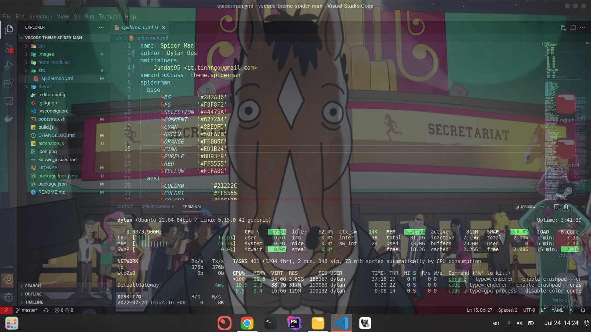
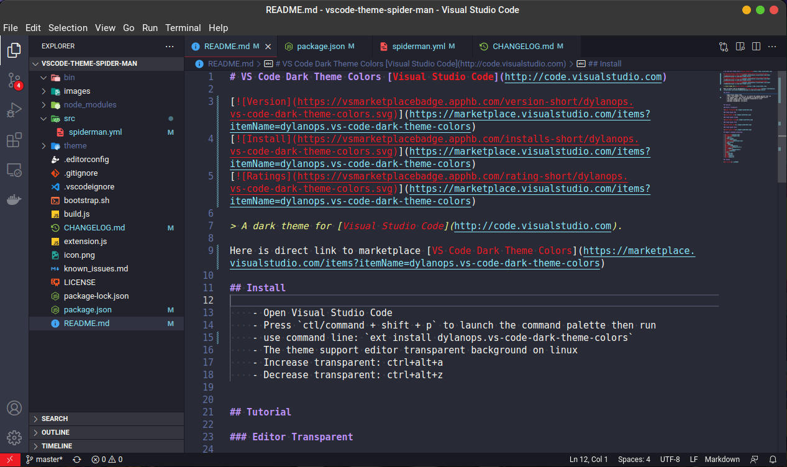
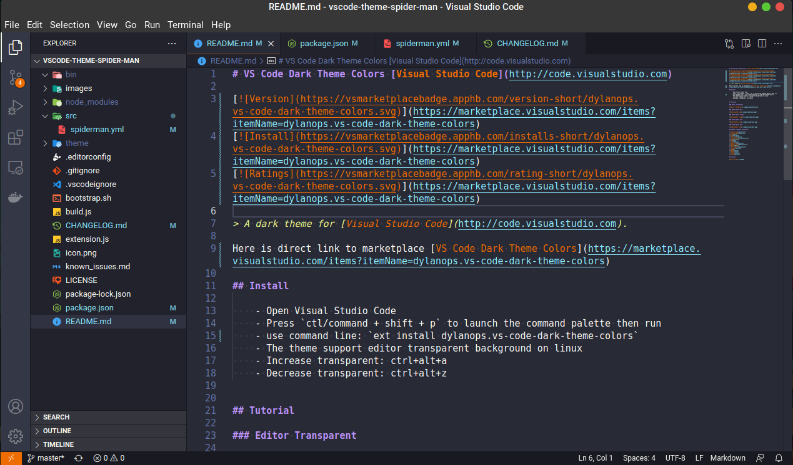
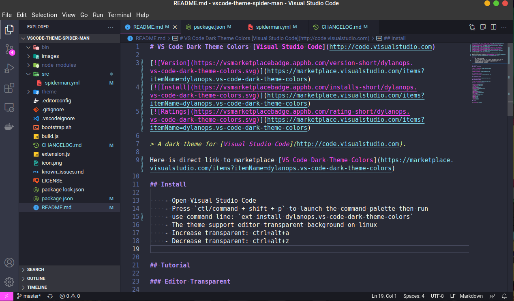

# VS Code Dark Theme Colors [Visual Studio Code](http://code.visualstudio.com)

> A dark theme for [Visual Studio Code](http://code.visualstudio.com).

Here is direct link to marketplace [VS Code Dark Theme Colors](https://marketplace.visualstudio.com/items?itemName=dylanops.vs-code-dark-theme-colors)

## Install

    - Open Visual Studio Code
    - Press `ctl/command + shift + p` to launch the command palette then run
    - use command line: `ext install dylanops.vs-code-dark-theme-colors`
    - The theme support editor transparent background on linux
    - Increase transparent: ctrl+alt+a
    - Decrease transparent: ctrl+alt+z

## Tutorial

## Editor Transparent

## Theme Red

## Theme Orange

## Theme Pink

## Theme Blue

## Support language programing

- [Javascript](Javascript)
- [TypeScript](TypeScript)
- [C++](#c++)
- [C#](#c-sharp)
- [Clojure](#clojure)
- [Coffeescript](#coffeescript)
- [F#](#f-sharp)
- [Go](#go)
- [Java](#java)
- [Makefile](#makefile)
- [Objective-C](#objective-c)
- [Perl](#perl)
- [Powershell](#powershell)
- [Python](#python)
- [R](#r)
- [Ruby](#ruby)
- [Rust](#rust)
- [Shell](#shell)
- [Swift](#swift)

## License

[MIT License](./LICENSE)
