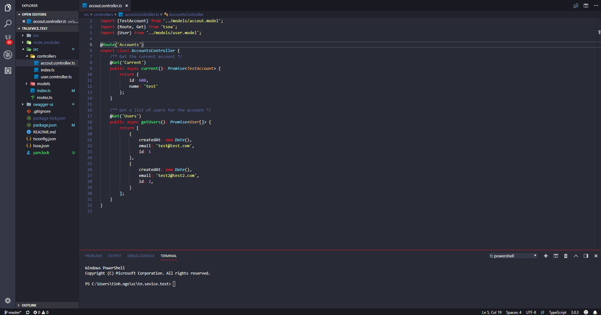
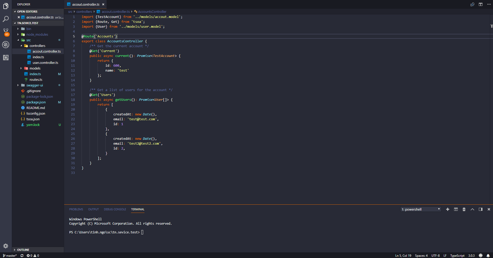
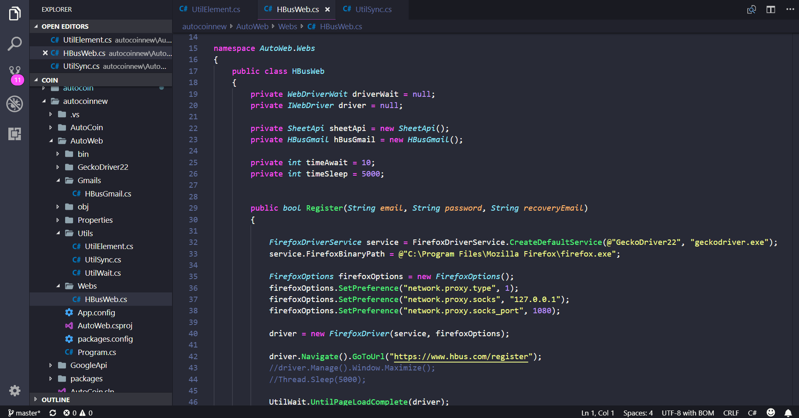
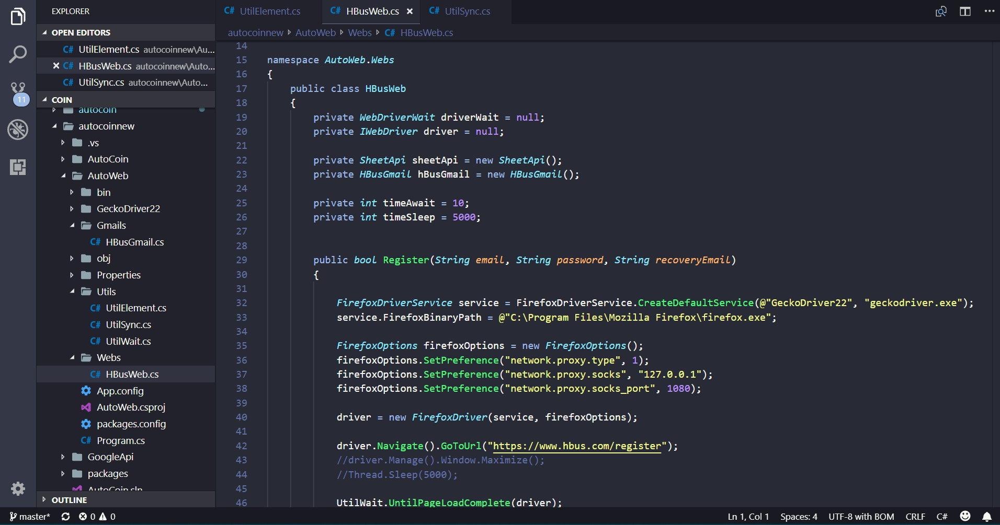

# Theme Spider Man for [Visual Studio Code](http://code.visualstudio.com)

> A dark theme for [Visual Studio Code](http://code.visualstudio.com).

Here is direct link to marketplace [Spider Man, Theme, Visual Code Theme](https://marketplace.visualstudio.com/items?itemName=jundat95.spiderman)

## Install

    - Open Visual Studio Code
    - Press `ctl/command + shift + p` to launch the command palette then run
    - use command line: `ext install jundat95.spiderman`

## Tutorial

### Theme Spider Man

### Theme Spider Orange

### Theme Spider Pink

### Theme Spider Blue

## Support language programing

- [Javascript](Javascript)
- [TypeScript](TypeScript)
- [C++](#c++)
- [C#](#c-sharp)
- [Clojure](#clojure)
- [Coffeescript](#coffeescript)
- [F#](#f-sharp)
- [Go](#go)
- [Java](#java)
- [Makefile](#makefile)
- [Objective-C](#objective-c)
- [Perl](#perl)
- [Powershell](#powershell)
- [Python](#python)
- [R](#r)
- [Ruby](#ruby)
- [Rust](#rust)
- [Shell](#shell)
- [Swift](#swift)

## License

[MIT License](./LICENSE)
